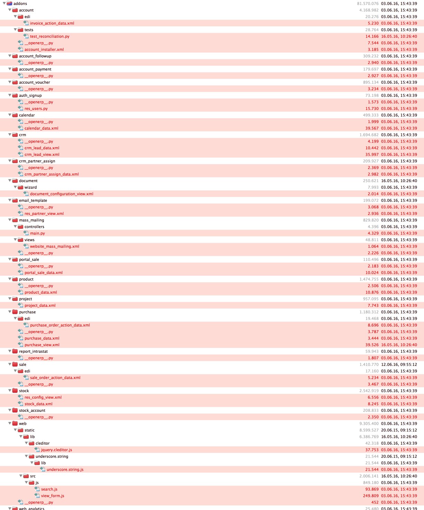

# Der MyOdoo Fork von Open Source ERP System Odoo
----
*Powered by*
*Equitania Software GmbH* 
*Weiherstrassse 13* 
*75173 Pforzheim* 
*Germany - Deutschland* 
*www.myodoo.de / www.equitania.de* 

----

MyOdoo ist ein "Fork" von Odoo, einem Browser gestützten Open Source Projekt für ERP, Warenwirtschaft, Lagerverwaltung, Webshop, CMS Anwendungen mit über 5.000 Zusatzmodule.

MyOdoo ist für den deutschsprachigen Raum optimiert. Deshalb werden nur die Sprachen Deutsch und Englisch unterstützt.
Unsere **deutschen Sprachübersetzungen unterscheiden** sich in Details von den Standardpaketen, da diese aus unserer Sicht teilweise falsch, mißverständlich oder gar nicht übersetzt sind.

Unser Fork wird regelmäßig mit dem Hauptodoo Fork abgeglichen.

`Aktuelle Buildversion: 20170601`

`Letzer Abgleich: 06.06.2017`

Dieser Fork obliegt der <a href="http://www.gnu.org/licenses/licenses.html">GNU Affero General Public License</a> wie das Ursprungssystem <a href="https://www.odoo.com">Odoo</a> selbst.

## Gute Gründe den MyOdoo Fork einzusetzen

- Der MyOdoo Fork ist optimiert für den deutschsprachigen Raum (D-A-CH), d.h. verbesserte Übersetzungen und geringere Größe
- Der MyOdoo Fork wird von einem deutschsprachigen Unternehmen betreut.
- Der MyOdoo Fork beinhaltet einige Verbesserungen und Bugfixes, die im Odoo Haupt Branch fehlen. Dennoch wird der Fork wöchentlich abgeglichen. 
- Der MyOdoo Fork wird über einen Release Manager verwaltet und ist bei vielen deutschen Unternehmen im Einsatz.

**Bugfixes & Änderungen abweichend vom Hauptfork Stand November 2016**

Siehe myodoo-server-fork-differences.png

Mit MyOdoo starten 
-------------------------
Für eine Installation .

Dazu haben wir einige Installationsskripte vorbereitet.

Vorbereitung von Debian 8 oder Ubuntu:

	https://github.com/equitania/odoo-addons/blob/8.0/scripts/prepare-odoo-server-debian8.sh

Zur Installation des Servers:

	https://github.com/equitania/odoo-addons/blob/8.0/scripts/install-odoo-server-debian8.sh

Weitere Informationen unter <a href="https://www.myoodoo.de">Myodoo.de</a>
oder <a href="https://leanpub.com/odoo-kochbuch">Das Odoo Kochbuch</a>
