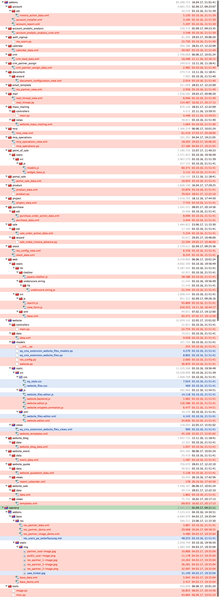

# Der MyOdoo Fork
----
*Powered by Equitania Software GmbH* 

MyOdoo ist ein "Fork" von Odoo, einem Browser gestützten Open Source Projekt für ERP, Warenwirtschaft, Lagerverwaltung, Webshop, CMS Anwendungen mit über 5.000 Zusatzmodule.

MyOdoo ist für den deutschsprachigen Raum optimiert. Deshalb werden nur die Sprachen Deutsch und Englisch unterstützt.
Unsere **deutschen Sprachübersetzungen unterscheiden** sich in Details von den Standardpaketen, da diese aus unserer Sicht teilweise falsch, mißverständlich oder gar nicht übersetzt sind.

## Gute Gründe den MyOdoo Fork einzusetzen

- Der MyOdoo Fork ist optimiert für den deutschsprachigen Raum (D-A-CH), d.h. verbesserte Übersetzungen und geringere Größe
- Der MyOdoo Fork wird von einem deutschsprachigen Unternehmen betreut.
- Der MyOdoo Fork beinhaltet einige Verbesserungen und Bugfixes, die im Odoo Haupt Branch fehlen. Dennoch wird der Fork wöchentlich abgeglichen. 
- Der MyOdoo Fork wird über einen Release Manager verwaltet und ist bei vielen deutschen Unternehmen im Einsatz.

**Bugfixes & Änderungen abweichend vom Hauptfork Stand April 2016**

## Kern

- /odoo/openerp/tools/misc.py -> Beschränkung der Sprachen auf Deutsch & Englisch

- /odoo/openerp/addons/base/res/res_config.py -> Erweiterung der Rechte-Gruppen um einen Managed Admin

- /odoo/openerp/addons/base/res/images.py -> Bildoptimierungen Website verbessert

## Addons

- /odoo/addons/account/account_installer.xml > Installationsassistent nur einmal starten lassen

- /odoo/addons/auth_signup/res_users.py > In Verbindung mit Auditlog kann es zu Endlosschleifen kommen

- /odoo/addons/document/wizard/document_configuration_view.xml > Installationsassistent nur einmal starten lassen

- /odoo/addons/product/product_data.xml -> Bessere deutsche Grundbegriffe für Lager und Preislisten

- /odoo/addons/project/project_data.xml -> Projektstatt werden nicht mehr überschrieben bei Update

- /odoo/addons/purchase/purchase_data.xml-> Bessere deutsche Grundbegriffe für Preislisten

- /odoo/addons/stock/stock_data.xml -> Bessere deutsche Grundbegriffe für Lager

- /odoo/addons/web/static/lib/underscore.string/lib.underscore.string.js -> Fehlerbeseitigung

- /odoo/addons/web/static/src/js/search.js -> Fehlerbeseitigung in der Suche

- /odoo/addons/web/static/src/js/view_form.js > Hilfevariable für Equitania Module ergänzt / Positionenrn. und Verkaufsaufträgen werden jetzt richtig hochgezählt

- /odooaddons/website/data/data.xml -> Website Menü-Eintrag Kontakt wird beim Update nicht mehr geändert

- /odoo/addons/website/static/src/js/website.editor.js > Website Bildverwaltung verbessert

- /odoo/addons/website/static/src/xml/website.editor.xml > Website Bildverwaltung verbessert

- /odoo/addons/website_blog/data/website_blog_data.xml > Website Menü-Eintrag Veranstaltung wird beim Update nicht mehr geändert

- addons/website_event/data/event_data.xml -> Website Menü-Eintrag Veranstaltung wird beim Update nicht mehr geändert

- addons/website_sale/data/data.xml -> Website Menü-Eintrag Shop wird beim Update nicht mehr geändert

- /odoo/addons/website_sale_options/__openerp__.py -> Fehlerbeseitigung

Unser Fork wird regelmäßig mit dem Hauptodoo Fork abgeglichen.

`Aktuelle Buildversion: 160403`

`Letzer Abgleich: 15.04.2016`

Dieser Fork obliegt der <a href="http://www.gnu.org/licenses/licenses.html">GNU Affero General Public License</a> wie das Ursprungssystem <a href="https://www.odoo.com">Odoo</a> selbst.

Mit MyOdoo starten 
-------------------------
Für eine Installation .

Dazu haben wir einige Installationsskripte vorbereitet.

Vorbereitung von Debian 8 oder Ubuntu:

	https://github.com/equitania/odoo-addons/blob/8.0/scripts/prepare-odoo-server-debian8.sh

Zur Installation des Servers:

	https://github.com/equitania/odoo-addons/blob/8.0/scripts/install-odoo-server-debian8.sh

Weitere Informationen unter <a href="https://www.myoodoo.de">Myodoo.de</a>